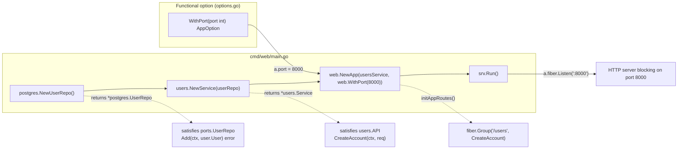
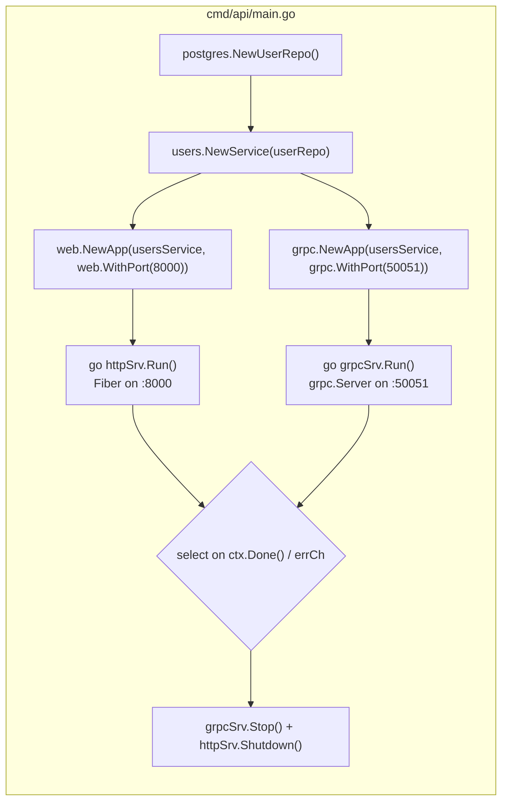
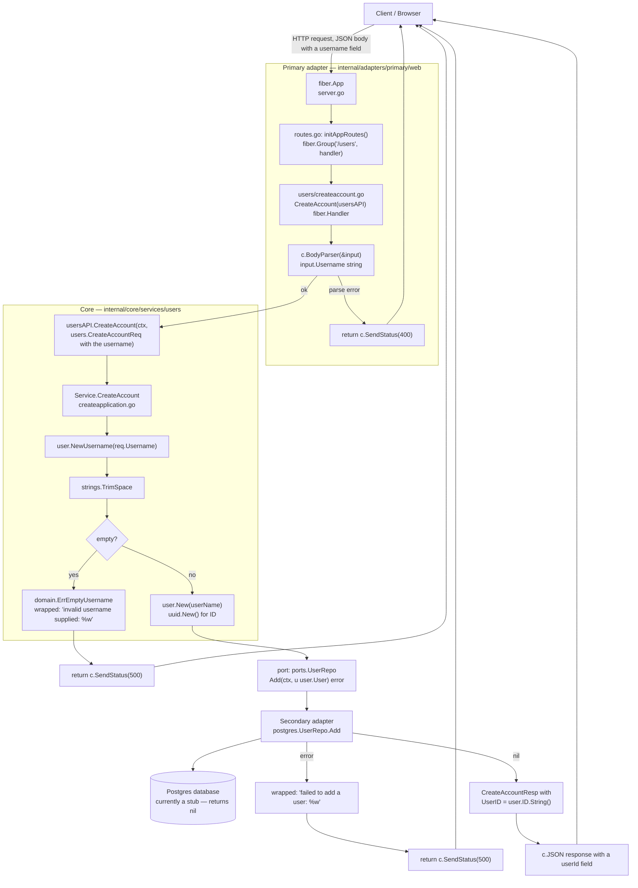
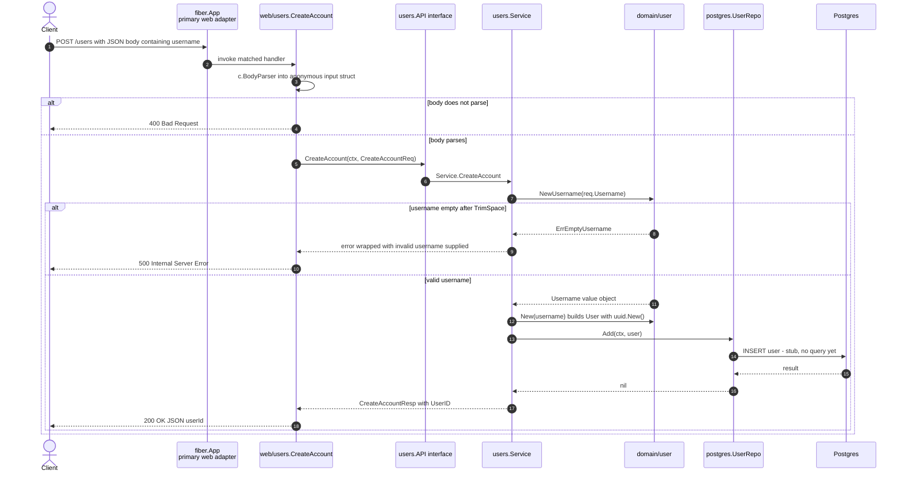
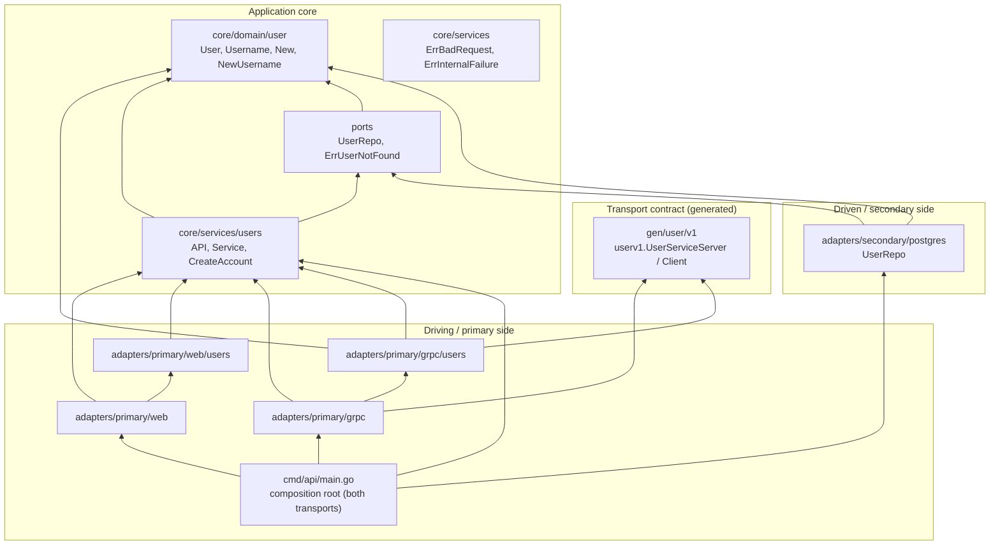
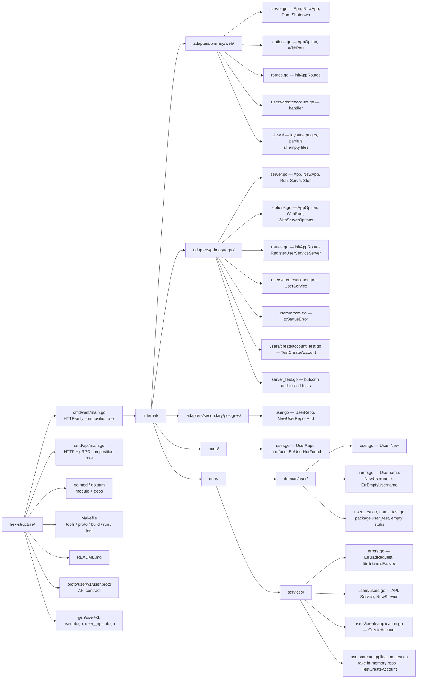
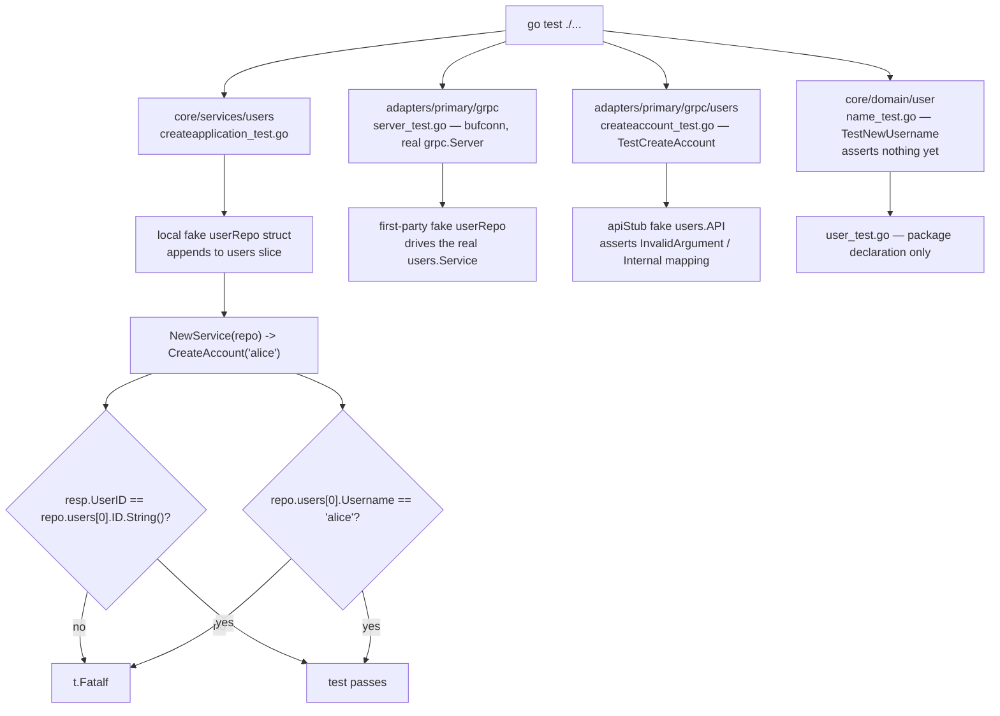
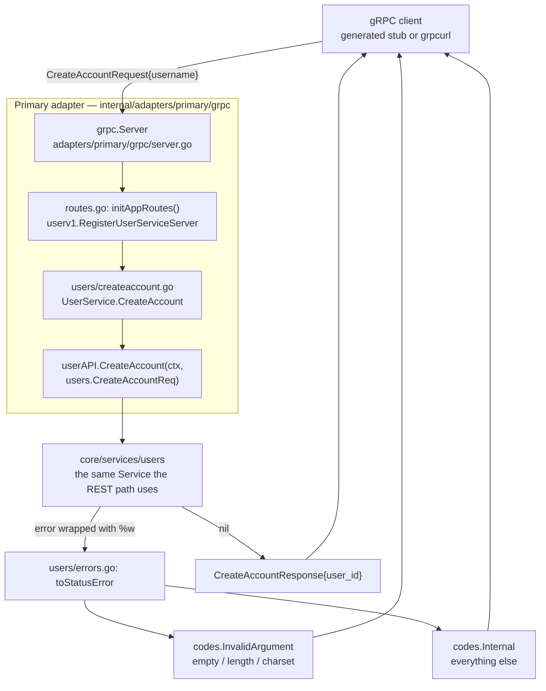

# hex-structure — Project Flow

Mermaid diagrams generated from the current source tree.

- Module: `github.com/samverrall/hex-structure` (`go 1.25.0` — raised from 1.21.0 by `google.golang.org/grpc` v1.84)
- Stack: Go, `github.com/gofiber/fiber/v2` (HTTP/REST), `google.golang.org/grpc` + `google.golang.org/protobuf`
  (gRPC), `github.com/google/uuid` (domain IDs)
- Pattern: Ports & Adapters (Hexagonal) — `internal/core` depends on nothing outside the stdlib,
  adapters depend on `internal/ports`, and `cmd/api/main.go` is the composition root that wires **two**
  primary adapters (HTTP + gRPC) onto the same `users.Service`.

| Layer | Package | Responsibility |
| --- | --- | --- |
| Composition root | `cmd/api` | Builds the repo + service, runs the HTTP and gRPC adapters side by side |
| Composition root (HTTP only) | `cmd/web` | Builds the repo + service, starts only the Fiber server |
| Primary / driving adapter | `internal/adapters/primary/web` | HTTP transport (Fiber), routes, handlers, views |
| Primary / driving adapter | `internal/adapters/primary/grpc` | gRPC transport, generated service registration, status mapping |
| API contract | `proto/user/v1` → `gen/user/v1` | `.proto` definition and the generated Go stubs |
| Ports | `internal/ports` | Interfaces + sentinel errors owned by the application |
| Core / domain | `internal/core/domain/user` | Entities and value objects (`User`, `Username`) |
| Core / services | `internal/core/services/users` | Use cases (`API`, `Service`, `CreateAccount`) |
| Secondary / driven adapter | `internal/adapters/secondary/postgres` | `ports.UserRepo` implementation (stub) |

## 1. Composition roots — startup wiring (`cmd/api`, `cmd/web`)



Notes:
- `NewApp` defaults `port` to `8000` and applies every `AppOption` before `initAppRoutes()`.
- `Run()` calls `fiber.Listen` which blocks until shutdown, so `main` never exits early.
- Any `error` from `NewUserRepo()` or `Run()` is fatal (`log.Fatalf`).

### Both transports in one binary — `cmd/api/main.go`



Notes:
- Because `Run()` blocks on both adapters, each is started in its own goroutine and the process waits on
  a buffered `errCh` (capacity 2) plus `signal.NotifyContext` for `SIGINT`/`SIGTERM`.
- The same `*users.Service` pointer is injected into both adapters — no duplicated business logic.
- `web.App.Shutdown()` and `grpc.App.Stop()` drain in-flight requests before the process exits.
- `grpc.NewApp` defaults `port` to `50051`; `WithServerOptions` lets callers add interceptors/credentials
  (the server itself is constructed *after* the options are applied).

## 2. Inbound request flow — `POST /users` (happy path)



### Registration detail (current behaviour)

`internal/adapters/primary/web/routes.go` registers the handler through `fiber.Group("/users", ...)`
with no method specified, so Fiber mounts it as middleware on the `/users` prefix (`app.Use`).
The handler writes a response and never calls `c.Next()`, so it terminates every request whose path
matches `/users` (any method), instead of a specific `POST /users` route.

## 3. Sequence diagram — `CreateAccount`



## 4. Dependency graph — who is allowed to import whom



Key rules visible in this graph:
- `internal/core/...` imports **only** the standard library plus `internal/ports` / its own domain —
  no Fiber, no `database/sql`, so business logic stays transport- and storage-agnostic.
- The dependency on persistence is inverted: `core/services` declares `ports.UserRepo`,
  and `adapters/secondary/postgres` implements it; the interface lives with the consumer.
- `internal/ports` owns the error vocabulary (`ErrUserNotFound`) and the domain import direction is
  `adapters -> ports -> domain`.
- `users.API` (in `core/services/users`) is the inbound port consumed by *both* primary adapters: the
  Fiber handler in `adapters/primary/web/users` and the gRPC service in `adapters/primary/grpc/users`.
  Any further driving adapter (CLI, queue consumer, ...) only needs to satisfy that interface.
- `gen/user/v1` (generated protobuf/gRPC stubs) is imported **only** by `adapters/primary/grpc` — the core
  and the HTTP adapter stay free of transport types.

## 5. File map



## 6. Test / verification flow



Commands:

```sh
go build ./...          # compile all packages
go vet ./...            # static checks
go test ./...           # unit + bufconn tests (fake repo, no Postgres needed)
go run ./cmd/api        # Fiber on :8000 AND gRPC on :50051, sharing one users.Service
go run ./cmd/web        # HTTP only, Fiber on :8000
make tools              # install protoc-gen-go / protoc-gen-go-grpc into $(go env GOPATH)/bin
make proto              # regenerate gen/user/v1 from proto/user/v1 (needs protoc on PATH)
```

## 7. Current state vs. ideal flow

| Step | Implemented? | Detail |
| --- | --- | --- |
| HTTP transport | ✅ | Fiber app with functional options, blocking `Listen` |
| Route `POST /users` | ⚠️ | Registered via `fiber.Group("/users", handler)` — matches any method on that prefix, not `POST` only |
| Request binding | ✅ | Anonymous struct parsed with `c.BodyParser`, `400` on failure |
| Domain validation | ✅ | `user.NewUsername` trims + rejects empty (`ErrEmptyUsername`) |
| Domain entity creation | ✅ | `user.New` assigns `uuid.New()` |
| Error mapping | ⚠️ | Every service error becomes `500`; `services.ErrBadRequest` / `ErrInternalFailure` and `ports.ErrUserNotFound` are declared but never used yet |
| Persistence | ⚠️ | `postgres.UserRepo.Add` is a stub returning `nil`; `db *sql.DB` is never opened or used |
| Views | ⚠️ | `views/layouts`, `views/pages`, `views/partials` files exist but are empty and never loaded |
| gRPC transport | ✅ | `grpc.NewServer` with functional options, blocking `Serve`, graceful `GracefulStop` |
| gRPC service registration | ✅ | `initAppRoutes` calls `userv1.RegisterUserServiceServer` with the adapter from `primary/grpc/users` |
| gRPC error mapping | ✅ | Domain validation errors → `codes.InvalidArgument`, everything else → `codes.Internal` |
| Shared business logic | ✅ | Both adapters are handed the same `*users.Service`; `internal/core` is untouched by the transport change |
| Proto codegen | ✅ | `proto/user/v1/user.proto` → `gen/user/v1` via `make proto` (protoc 36.2, protoc-gen-go-grpc v1.6.2) |
| Dual-transport shutdown | ✅ | `cmd/api` drains both servers on `SIGINT`/`SIGTERM` (`Stop()` + `Shutdown()`) |
| Username length rule | ✅ | `minUsernameLen = 5` / `maxUsernameLen = 100` in `name.go`, plus a letters/digits/`_`/`-` charset check (`ErrUsernameCharset`) |
| Tests | ⚠️ | `createapplication_test.go` and the two gRPC adapter tests assert; domain tests are empty stubs |

## 8. gRPC inbound request flow — `user.v1.UserService/CreateAccount`



Notes:
- The adapter holds the inbound port as `users.API`, so the transport cannot reach past the application
  boundary into the domain or the repository.
- `UserService` embeds `userv1.UnimplementedUserServiceServer`, which is what satisfies the generated
  `UserServiceServer` interface and keeps the adapter forward compatible when new RPCs are added.
- Error translation lives in one place (`toStatusError`) and relies on `errors.Is`, because the service
  wraps the domain sentinels with `%w`.
- Cancellation, deadlines and metadata arrive as a plain `context.Context`, which the core already takes
  as its first argument — a gRPC deadline therefore propagates all the way to the repo call.
- Verified live: `CreateAccount(charlie)` returns a `userId`; `CreateAccount("b")` returns
  `code = InvalidArgument, desc = "invalid username supplied: username must be between 5 and 100 characters"`.
