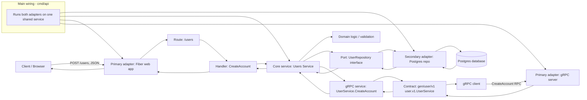

# Project Flow

## Explanation

1. A request enters through either the web adapter (REST) or the gRPC adapter.
2. The route / registered RPC method calls the user account handler.
3. The handler delegates to the same core service in both cases.
4. The service applies domain validation and business rules.
5. It depends on a repository port, implemented by the Postgres adapter.
6. The adapter persists the data in the database.
7. Results flow back to the client — as JSON over HTTP, or as a protobuf message with a gRPC status code.

This is a hexagonal architecture pattern: the core business logic is isolated from HTTP, gRPC and database
details, which is why swapping in gRPC only added an adapter plus a generated contract.
